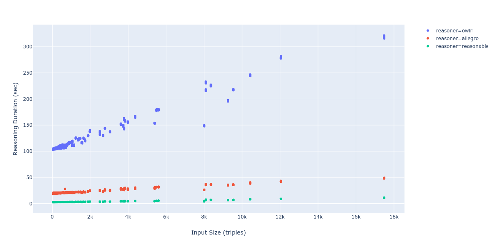

q# Reasonable

[](https://travis-ci.org/gtfierro/reasonable)

An OWL 2 RL reasoner with reasonable performance

## Performance

Comparing performance of `reasonable` with [OWLRL](https://github.com/RDFLib/OWL-RL) and [Allegro](https://franz.com/agraph/support/documentation/current/materializer.html). Evaluation consisted of loading Brick models of different sizes into the respective reasoning engine and timing how long it took to produce the materialization. `reasonable` is about 7x faster than Allegro and 38x faster than OWLRL on this workload.



## How to Use

### Python

To facilitate usage, we use the [pyo3](https://pyo3.rs/) project to generate Python 3.x bindings to this project.
Installing these *should* be as easy as `pip install reasonable`.

See also the [`brickschema`](https://github.com/BrickSchema/py-brickschema) package for working with Brick models. The package provides a generic interface to this reasoner and several others.

Usage looks like:

```python
import reasonable

# import triples from an rdflib Graph
import rdflib
g = rdflib.Graph()
g.parse("example_models/ontologies/Brick.n3", format="n3")
g.parse("example_models/small1.n3", format="n3")

r = reasonable.PyReasoner()
r.from_graph(g)
triples = r.reason()
print("from rdflib:", len(triples))

# import triples from files on disk
r = reasonable.PyReasoner()
r.load_file("example_models/ontologies/Brick.n3")
r.load_file("example_models/small1.n3")
triples = r.reason()
print("from files:", len(triples))
```

### Rust

See [Rust docs](https://docs.rs/reasonable)

Example of usage from Rust:

```rust
use ::reasonable::owl::Reasoner;
use std::env;
use std::time::Instant;
use log::info;

fn main() {
    env_logger::init();
    let mut r = Reasoner::new();
    env::args().skip(1).map(|filename| {
        info!("Loading file {}", &filename);
        r.load_file(&filename).unwrap()
    }).count();
    let reasoning_start = Instant::now();
    info!("Starting reasoning");
    r.reason();
    info!("Reasoning completed in {:.02}sec", reasoning_start.elapsed().as_secs_f64());
    r.dump_file("output.ttl").unwrap();
}
```


## OWL 2 Rules

Using rule definitions from [here](https://www.w3.org/TR/owl2-profiles/#Reasoning_in_OWL_2_RL_and_RDF_Graphs_using_Rules).

**TODO**: implement RDF/RDFS entailment semantics as described [here](https://www.w3.org/TR/rdf11-mt/)

**Note**: haven't implemented rules that produce exceptions; waiting to determine the best way of handling these errors.

### Equality Semantics

|Completed| Rule name | Notes |
|---------|----------|-------|
| no     | `eq-ref` | implementation is very inefficient; causes lots of flux       |
| **yes**| `eq-sym` |       |
| **yes**| `eq-trans` |       |
| **yes**| `eq-rep-s` |       |
| **yes**| `eq-rep-p` |       |
| **yes**| `eq-rep-o` |       |
| no     | `eq-diff1` | throws exception |
| no     | `eq-diff2` | throws exception |
| no     | `eq-diff3` | throws exception |

### Property Axiom Semantics

|Completed| Rule name | Notes |
|---------|----------|-------|
| no        | `prp-ap` |       |
| **yes**   | `prp-dom` |       |
| **yes**   | `prp-rng` |       |
| **yes**   | `prp-fp` |       |
| **yes**   | `prp-ifp` |       |
| **yes**   | `prp-irp` | throws exception |
| **yes**   | `prp-symp` |       |
| **yes**   | `prp-asyp` | throws exception |
| **yes**   | `prp-trp` |       |
| **yes**   | `prp-spo1` |       |
| no        | `prp-spo2` |       |
| **yes**   | `prp-eqp1` |       |
| **yes**   | `prp-eqp2` |       |
| **yes**   | `prp-pdw` | throws exception |
| no        | `prp-adp` | throws exception |
| **yes**   | `prp-inv1` |       |
| **yes**   | `prp-inv2` |       |
| no        | `prp-key` |       |
| no        | `prp-npa1` | throws exception |
| no        | `prp-npa2` | throws exception |

### Class Semantics

|Completed| Rule name | Notes |
|---------|----------|-------|
| **yes**| `cls-thing` |       |
| **yes**| `cls-nothing1` |       |
| **yes**| `cls-nothing2` | throws exception       |
| **yes**| `cls-int1` |       |
| **yes**| `cls-int2` |       |
| **yes**| `cls-uni` |       |
| **yes**| `cls-com` | throws exception    |
| **yes**| `cls-svf1` |       |
| **yes**| `cls-svf2` |       |
| **yes**| `cls-avf` |       |
| **yes**| `cls-hv1` |       |
| **yes**| `cls-hv2` |       |
| no     | `cls-maxc1` | throws exception       |
| no     | `cls-maxc2` |       |
| no     | `cls-maxqc1` | throws exception       |
| no     | `cls-maxqc2` | throws exception      |
| no     | `cls-maxqc3` |       |
| no     | `cls-maxqc4` |       |
| no     | `cls-oo` |       |

### Class Axiom Semantics

|Completed| Rule name | Notes |
|---------|----------|-------|
| **yes**| `cax-sco` |       |
| **yes**| `cax-eqc1` |       |
| **yes**| `cax-eqc2` |       |
| **yes**| `cax-dw` | throws exception      |
| no     | `cax-adc` |  throws exception     |

### Other

- no datatype semantics for now
